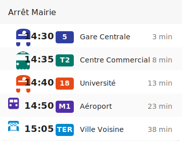

# Carte Lovelace des Prochains Départs SIRI

Cette carte personnalisée permet d'afficher les prochains départs de transports en commun à partir d'un capteur SIRI Next Departures.

## Aperçu



## Fonctionnalités

- Affichage des prochains départs avec heure et temps d'attente
- Icônes adaptées au mode de transport (bus, tram, train, métro, ferry)
- Personnalisation du nombre de départs affichés
- Interface utilisateur intuitive
- Mise en page responsive

## Installation

1. Copiez le fichier `siri-next-departure-card.js` dans le dossier `/config/www/` de votre installation Home Assistant.

2. Ajoutez la ressource à votre configuration Lovelace:
   - Via l'interface utilisateur: **Paramètres** > **Tableau de bord** > Cliquez sur le menu (**⋮**) > **Éditer le tableau de bord** > **Ressources** > **Ajouter une ressource**
     - URL: `/local/siri-next-departure-card.js`
     - Type: `JavaScript Module`
   - Ou ajoutez manuellement dans votre configuration YAML:
     ```yaml
     resources:
       - url: /local/siri-next-departure-card.js
         type: module
     ```

3. Redémarrez Home Assistant (ou actualisez votre navigateur).

## Utilisation

### Ajouter la carte à votre tableau de bord

1. Modifiez votre tableau de bord Lovelace
2. Cliquez sur **+ Ajouter une carte**
3. Recherchez **Carte des prochains départs SIRI**
4. Configurez la carte:
   - **Entité**: Sélectionnez un capteur SIRI Next Departures (ex: `sensor.next_departures_arret_mairie`)
   - **Nombre max de départs**: Définissez le nombre maximum de départs à afficher (par défaut: 5)

### Configuration YAML manuelle

```yaml
type: 'custom:siri-next-departure-card'
entity: sensor.next_departures_arret_mairie
max_departures: 5
```

## Personnalisation

La carte affiche automatiquement:
- L'heure de départ prévue
- Le numéro/nom de la ligne
- La destination
- Le temps d'attente en minutes
- Une icône adaptée au mode de transport

Les icônes changent automatiquement selon le mode de transport rapporté par le capteur:
- 🚌 Bus (par défaut)
- 🚊 Tram
- 🚂 Train/Rail
- 🚇 Métro/Subway
- ⛴️ Ferry/Bateau

## Dépannage

- Si aucun départ n'est affiché, vérifiez que votre capteur SIRI fonctionne correctement.
- Si les temps d'attente sont incorrects, vérifiez que votre fuseau horaire Home Assistant est correctement configuré.
- Pour signaler un bug, veuillez ouvrir une issue sur GitHub. 